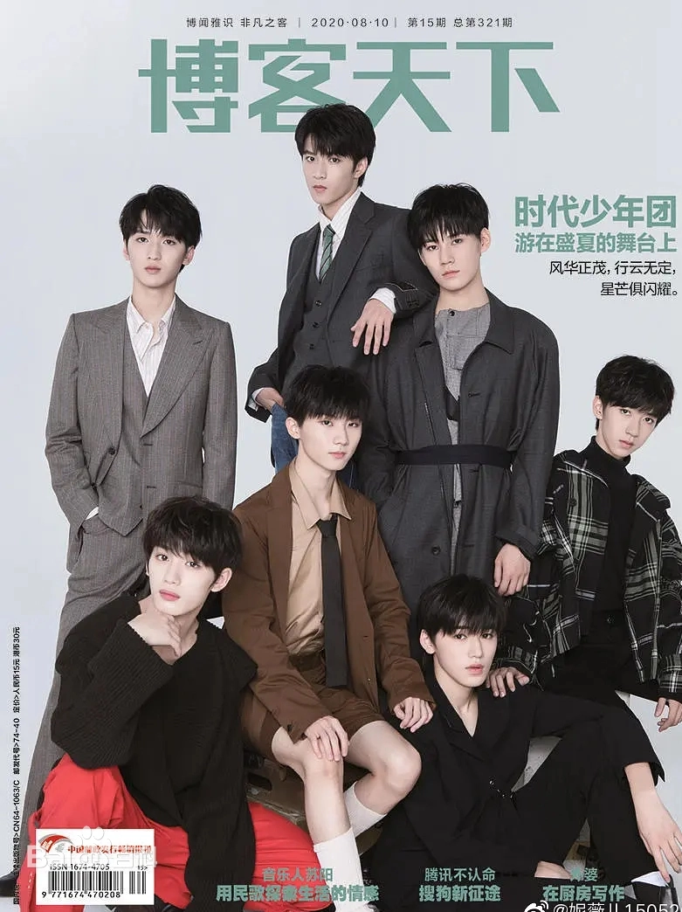

# 时代少年团
## 基本信息
时代少年团（Teens in Times、TNT）是由时代峰峻推出的中国内地男子演唱组合，由**马嘉祺**、**丁程鑫**、**宋亚轩**、**刘耀文**、**张真源**、**严浩翔**、**贺峻霖**七人组成。
### 成立时间
2019年
### 经纪公司
*北京时代峰峻文化艺术发展有限公司*
### 百度百科
>[时代少年团](https://baike.baidu.com/item/%E6%97%B6%E4%BB%A3%E5%B0%91%E5%B9%B4%E5%9B%A2/23799998?fr=aladdin)
## 主要作品
### 音乐单曲
| 歌曲名称 | 歌曲风格 | 发行时间 |
| :-----:|  :----: | :----: |
| 2035是这young | POP流行 | 2020.12.28 |
| 晴雅集 | SOUNDTRACK原声   | 2020.12.10 |
| 要你管 | POP流行 | 2020.12.01 |
| 只有我一个人觉得？ | POP流行 | 2020.12.01 |
| 相遇 | POP流行 | 2020.08.31 |
| 姐姐真漂亮 | POP流行 | 2020.08.14 |
| 爆米花 | POP流行 | 2020.04.03 |
| 梦游记 | POP流行 | 2020.01.07 |
| 无尽的冒险 | POP流行 | 2019.11.23 |
| 全校通报 | POP流行 | 2019.11.22 |
### 音乐专辑
《按时长大》  
《之》  
《少年江湖》
### 综艺节目
#### 2019年
1. 2020爱奇艺尖叫之夜  
2. 2019双十一狂欢夜  
3. TMEA腾讯音乐娱乐盛典  
4. 2019-2020湖南卫视跨年演唱会
#### 2020年
* 演员请就位第二季   
* 跨次元新星  
* 少年梦游记  
* 第27届东方风云榜
#### 2021年
王牌对王牌第六季  
接招吧！前辈  

### 杂志写真


## 获奖记录

[TNT](./TNT.md)


## 代码

Inline `code`

Indented code

    // Some comments
    line 1 of code
    line 2 of code
    line 3 of code


~~Syntax highlighting~~

``` c
printf("时代少年团横空出世")；
```
